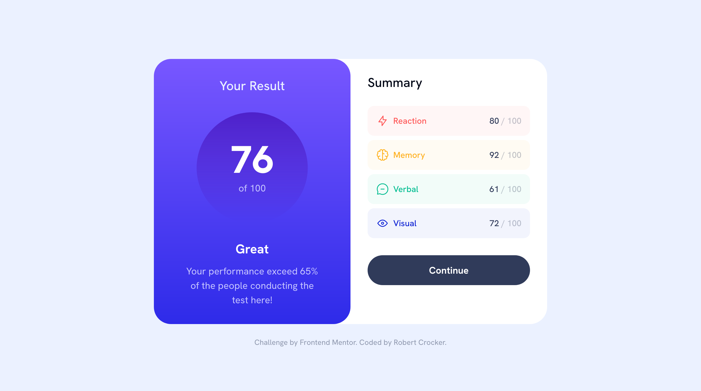

# Frontend Mentor - Results summary component solution

This is a solution to the [Results summary component challenge on Frontend Mentor](https://www.frontendmentor.io/challenges/results-summary-component-CE_K6s0maV). Frontend Mentor challenges help you improve your coding skills by building realistic projects. 

## Table of contents

- [Overview](#overview)
  - [The challenge](#the-challenge)
  - [Screenshot](#screenshot)
  - [Links](#links)
- [My process](#my-process)
  - [Built with](#built-with)
  - [What I learned](#what-i-learned)
- [Author](#author)

## Overview

### The challenge

Users should be able to:

[x] View the optimal layout for the interface depending on their device's screen size
[x] See hover and focus states for all interactive elements on the page
[x] **Bonus**: Use the local JSON data to dynamically populate the content

### Screenshot

### Links

- [Live Site](https://fem-result-summary-component-mocha.vercel.app)

## My process

### Built with

- [Tailwind](https://tailwindcss.com/)
- [React](https://reactjs.org/)
- [NextJS](https://nextjs.org/)

### What I learned

I know this not the go-to recommendation, but I did reach for the [safelist](https://tailwindcss.com/docs/content-configuration) feature from Tailwind in this solution. It was fun to learn that it exists and in what situations you should use the feature.

## Author

- Website - [Robert Crocker](https://www.robcrock.com)
- Frontend Mentor - [@robcrock](https://www.frontendmentor.io/profile/robcrock)
- Twitter - [@robcrock](https://twitter.com/robcrock)
- LinkedIn - [@robercrocker](https://www.linkedin.com/in/robertcrocker/)
